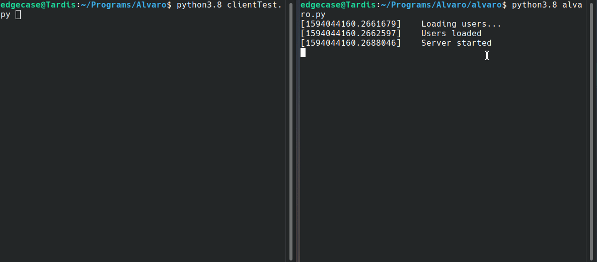

# Alvaro
---
[](https://opensource.org/licenses/MIT) [](https://pyup.io/repos/github/edgecase963/Alvaro/) [](https://github.com/psf/black)

Alvaro is an easy to use networking module built to save you time on your projects without compromising on reliability, security or functionality.
It offers SSL support, user management and many more features to help you on your projects.

### A quick demo..


To learn more, check out [the wiki!](https://github.com/edgecase963/Alvaro/wiki)

Tired of spending hours, sometimes even days writing up complicated code just to get two devices to talk to one another? Alvaro is what you're looking for. All the difficult tasks of flow control, encryption and _endless_ bugs all taken care of for you! This project provides you the ability to create a fully functional server in just a few lines of code. So you can dive right into your project.

After all, time is our most valuable resource.


```bash

# clone alvaro
git clone https://github.com/edgecase963/Alvaro

cd Alvaro

# Install requirements
pip3 install -r requirements.txt

# install Alvaro
sudo python3 setup.py install

```

This project is completely open source and anyone is free to use it.

CodeFactor Rating

[](https://www.codefactor.io/repository/github/edgecase963/alvaro)


Alvaro comes with some built-in features to help make data transfer not just more reliable, but easier to manage and implement into your project. One of these is the ability to monitor an ongoing download.


